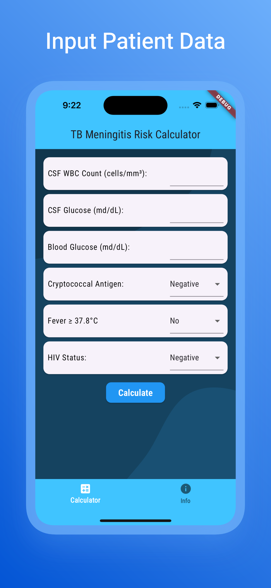
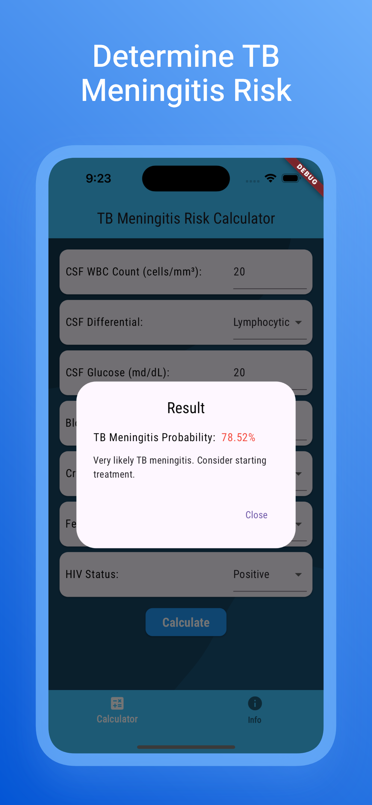
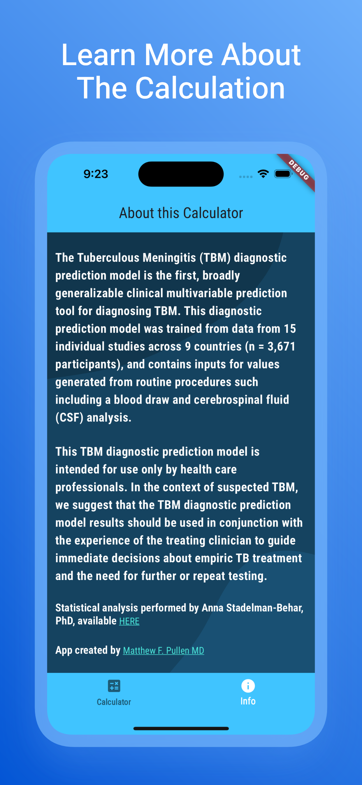

# TB Meningitis Risk Calculator

This app is built to allow for offline use the the TB Mengitis Risk Calculator, using the latest research by Dr. Anna Stadelman-Behar PhD. The research supporting this calculator can be found at [https://doi.org/10.4269/ajtmh.23-0789](https://doi.org/10.4269/ajtmh.23-0789). 

Using this app, you can input patient-specific data points and generate an approximate risk of TB meningitis using common diagnostic measures in this patient population. The hope is that by putting this tool in the hands of clinicians worldwide, we can help them diagnose TB meningitis earlier and more reliably, thus saving lives in settings where diagnostic uncertainty is common.

## Privacy Policy

Matthew Pullen built the TB Meningitis Risk Calculator app as a Free app. This SERVICE is provided by Matthew Pullen at no cost and is intended for use as is.

Last updated: July 24, 2024

This Privacy Policy describes Our policies and procedures on the collection, use and disclosure of Your information when You use the Service and tells You about Your privacy rights and how the law protects You.

We do not use or collect any of Your Personal data via this app. 

This Privacy Policy has been created with the help of the Free Privacy Policy Generator.

**Information Collection and Use**

This app does not collect Your Personal data, nor does it use any third-party libraries or services that collect your information.

**Children's Privacy**

Our Service does not address anyone under the age of 13. We do not knowingly collect personally identifiable information from anyone under the age of 13. 

**Links to Other Websites**

Our Service may contain links to other websites that are not operated by Us. If You click on a third party link, You will be directed to that third party's site. We strongly advise You to review the Privacy Policy of every site You visit.

We have no control over and assume no responsibility for the content, privacy policies or practices of any third party sites or services.

**Changes to this Privacy Policy**

We may update Our Privacy Policy from time to time. We will notify You of any changes by posting the new Privacy Policy on this page.

We will let You know via email and/or a prominent notice on Our Service, prior to the change becoming effective and update the "Last updated" date at the top of this Privacy Policy.

You are advised to review this Privacy Policy periodically for any changes. Changes to this Privacy Policy are effective when they are posted on this page.

**Contact Us**

If you have any questions about this Privacy Policy, You can contact us:

    By email: matthew.pullen@gmail.com

    By visiting this page on our website: [https://github.com/mfpullen22/tbm_calc_app](https://github.com/mfpullen22/tbm_calc_app)

